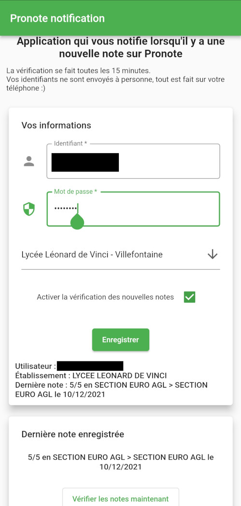

# Pronote notification

Application Android vérifiant les nouvelles notes sur Pronote et prévient par notification

## Fonctionnalités 

Application codée et testée pour 2 établissements :

- Lycée Léonard de Vinci à Villefontaine
- Collège Fernand Bouvier à Saint Jean de Bournay
- Les 2 utilisant le CAS ac-grenoble

### Captures d'écrans

## Ajout d'un établissement

Normallement elle est utilisable avec d'autres (en ajoutant leur URL dans le code source).
Je n'ai cepandant pas fais tous les modes d'échanges avec Pronote donc à vous de finir le travail (pas très compliqué, le socle est déjà fait).

## Points à revoir

- Le nommage des variables (un coup en anglais et un autre en français).
- Les modèles Pronote (classes) sont à réorganiser